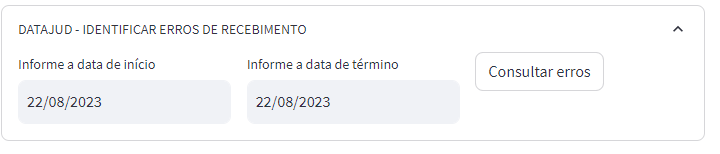

# Ferramentas DATAJUD
Link de acesso a ferramenta: [Acesse a ferramenta aqui](https://toolsdatajud.app.tjpe.jus.br/)

## Informações do projeto
Aplicativo que tem por finalidade disponibilizar algumas ferramentas para facilitar o tratamento das informações enviadas e recebidas pelo DATAJUD. Nesta primeira vesão, disponibilizamos a seguinte funcionalidade:

## Estrutura do projeto
tool-datajud/  
├── app.py                  -- codigo da aplicação com as funcionalidades.  
├── Pipfile                 -- arquivo de configuracao do ambiente de desensolvimento.  
├── Pipfile.lock            -- arquivo de configuracao do ambiente - dev.  
├── README.md               -- arquivo com informacoes do projeto.  
├── requirements.txt        -- arquivo de configuracao com as bibliotecas utilizadas no projeto.  
├── .s2i/                   -- pasta com configurações do deploy openshift.  
│   └── bin/      
├── .ugc                    -- pasta com configurações do deploy jenkins.  
|   └── scripts/      
└── .db                     -- pasta com configurações do banco.  
    └── scripts/      

### Verificação de erro no recebimento dos arquivos no DATAJUD
  
O objetivo desta fucnionalidade é verificar os erros de recebimento dos arquivos enviados ao DATAJUD num determinado período de tempo.  Passo a passo:
1. Consultar no DATAJUD o status dos arquivos enviados no período de tempo informado.
2. Caso exista arquivos com erro:  
2.1. Obter o número do protocolo de envio no DATAJUD  
2.2. Consultar o protocolo no banco de dados e obter o conteúdo do arquivo XML enviado ao DATAJUD  
2.3. Submeter o conteúdo do arquivo ao VALIDADOR DO DATAJUD  
2.4. Analisar as críticas e apresentar o erro identificado.
3. Informar caso não exista arquivos enviados no período;
4. Informar resumo do status quando existirem arquivos enviados mas sem erro no recebimento.

